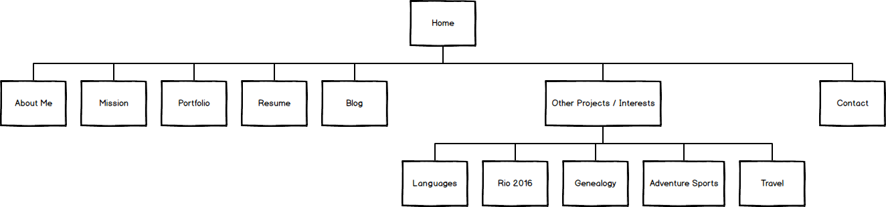

1. What are the 6 Phases of Web Design?

  1. Information Gathering
  2. Planning
  3. Design
  4. Development
  5. Testing and Delivery
  6. Maintenance

2. What is your site's primary goal or purpose? What kind of content will your site feature?

  My site's primary goal is to help me get a job as a programmer.  To this end, my site will feature content that highlights all the things that I bring to the table as a potential employee, contractor, or consultant.  This includes my portfolio of programming projects for Dev Bootcamp, my resume, links to my LinkedIn profile and GitHub account, a photo of myself, my technical blog, how to contact me, some basic information about me, my mission/gifts, and some more in-depth information about my interests and other projects.

3. What is your target audience's interests and how do you see your site addressing them?

  My target audience's interests are in finding good employees/contractors/consultants/staff/partners to assist them in accomplishing their goals, whatever they may be.  In my case their needs will be for full-stack and UX/UI programming and web/graphic design.  My site will address their interests by showing off my skills in these areas, and by also highlighting my strengths working with a team and why I'm a cool person to work with.

4. What is the primary "action" the user should take when coming to your site? Do you want them to search for information, contact you, or see your portfolio? It's ok to have several actions at once, or different actions for different kinds of visitors.

  The action I want the user to take is to contact me about working with them.

5. What are the main things someone should know about design and user experience?

  Good design and good user experience are super-important.  While people may have inherent strengths or weaknesses in the areas of design and user experience, these are skills that can be learned and continually improved upon.

6. What is user experience design and why is it valuable? 

  User experience design concerns how the user interacts with your website or web application.  How do they navigate amongst the various pages, and does that navigation fulfill the goals of the site (e.g. fun, efficient, provocative, conservative)?  What perceptions or impressions is the user left with while and after using your website/web application?  Was it easy for the user to accomplish or find what they wanted?  Did they have a pleasant sensory and cognitive experience?  This is valuable because if these needs aren't met, the user is less likely to come back to your site and less likely to recommend it to others, and you may be failing your goals for your website/web application.

7. Which parts of the challenge did you find tedious?

  Figuring out how to format things in Markdown :-).  Other than that, none of it was tedious.

