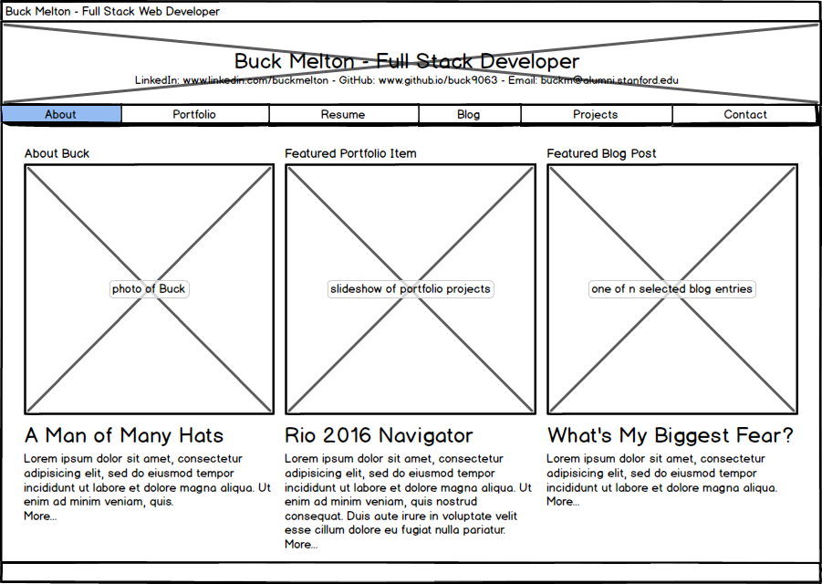
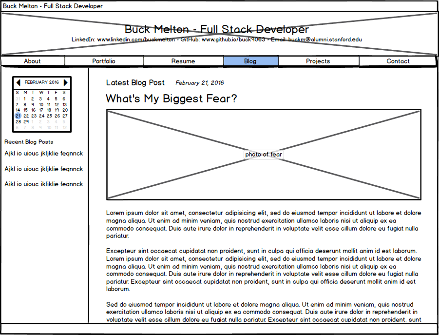

# Reflections for Assignment 2.4 - Wireframing

## Index Wireframe for Buck's Career Website:

## Blog Index Wireframe for Buck's Career Website:

## Reflection Questions:

1. What is a wireframe?

  A wireframe is a rough sketch that shows the basic layout of the elements of a webpage.  It is so-called because typically only black outlines of the elements (images, text boxes, labels, buttons) are shown, which look like wire segments.

2. What are the benefits of wireframing?

  The benefits of wireframing are being able to quickly get clear on how the various elements on a webpage will be laid out relative to each other and approximate sizes of the elements.  It's difficult, if not impossible, to begin straight-off coding the HTML for a page without first knowing the approximate size and layout of all the elements.  A wireframe is a cheap way to validate all the sizing and layout concerns, and make as many adjustments as necessary, before too much time-intensive HTML coding has already been done.  A wireframe also easily allows the designer to experiment with many possibilities for layout.

3. Did you enjoy wireframing your site?

  Yes!

4. Did you revise your wireframe or stick with your first idea?

  For my main index, it evolved gradually as I created it, but there were no overhauls.  For my blog index, I kept it essentially the same but switched the calendar nav from the right-hand-side to the left-hand-side.

5. What questions did you ask during this challenge? What resources did you find to help you answer them?

  My questions mostly had to do with how to use Balsamiq, and I was able to find all the answers in the Balsamiq documentation.  I also had questions about Markdown formatting while writing this Reflection, which I answered by using this cheatsheet: https://github.com/adam-p/markdown-here/wiki/Markdown-Cheatsheet

6. Which parts of the challenge did you enjoy and which parts did you find tedious?

  There haven't been any tedious parts yet, but I'm anticipating that adding, committing, merging, and pulling will be tedious.

