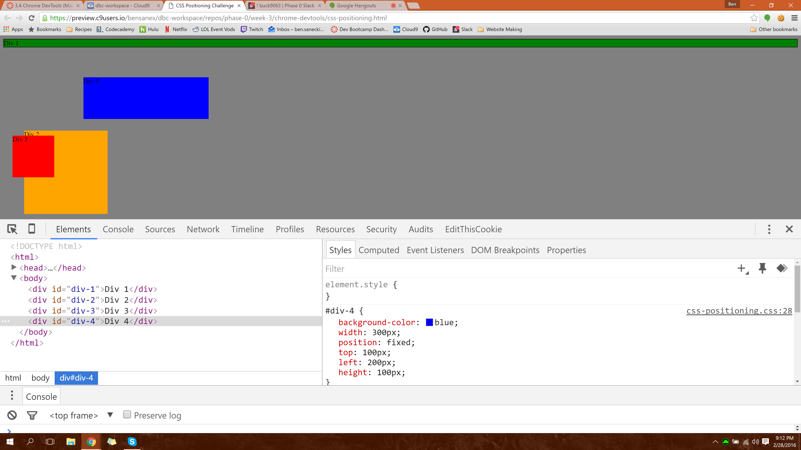
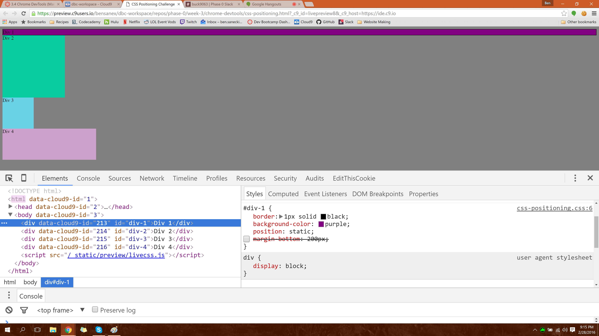
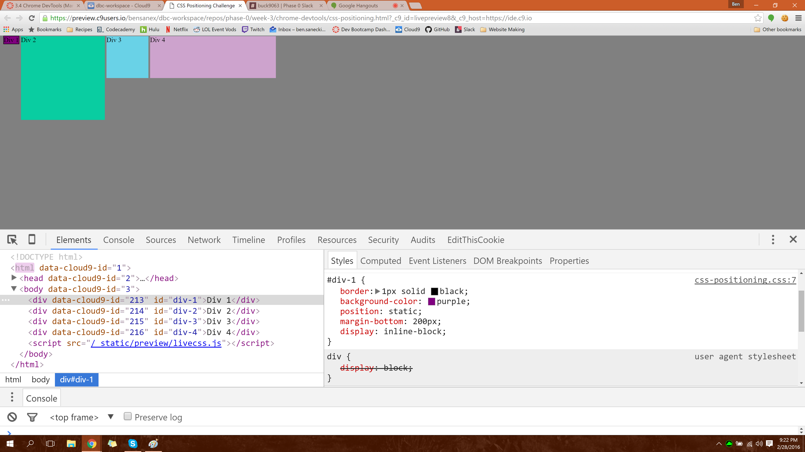
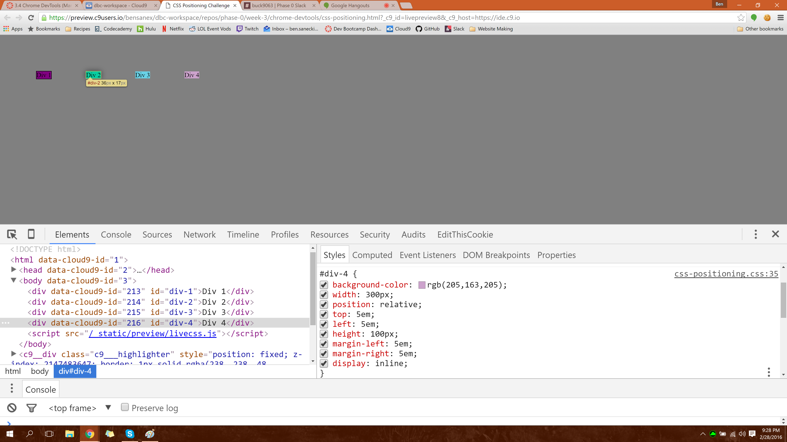
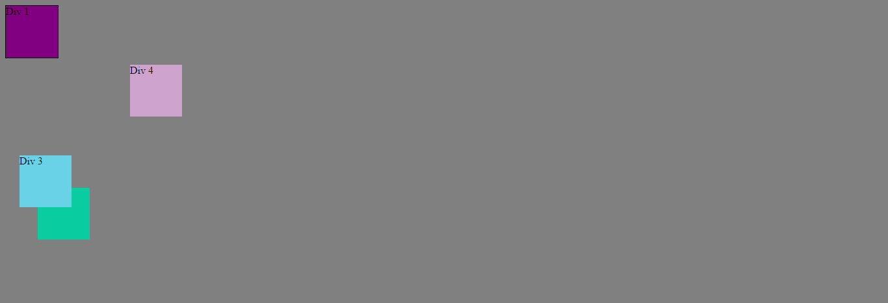
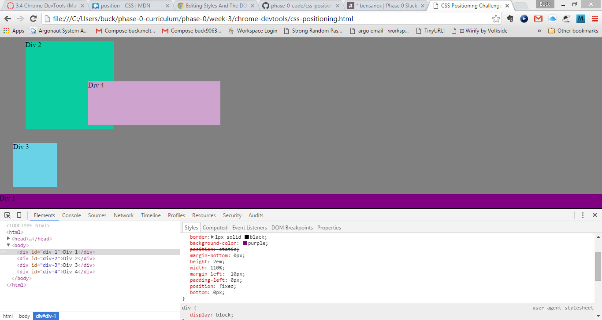
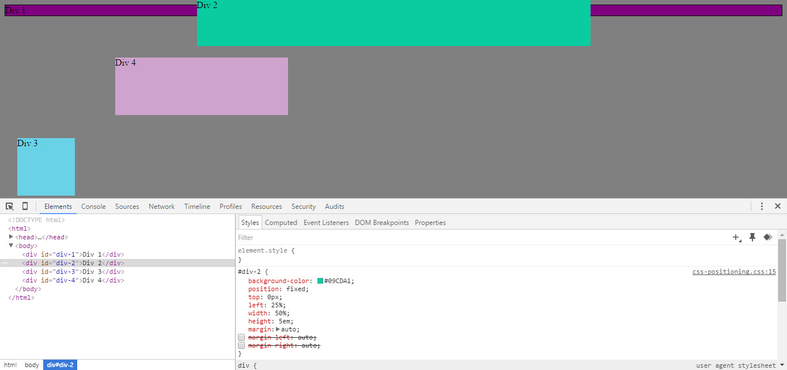
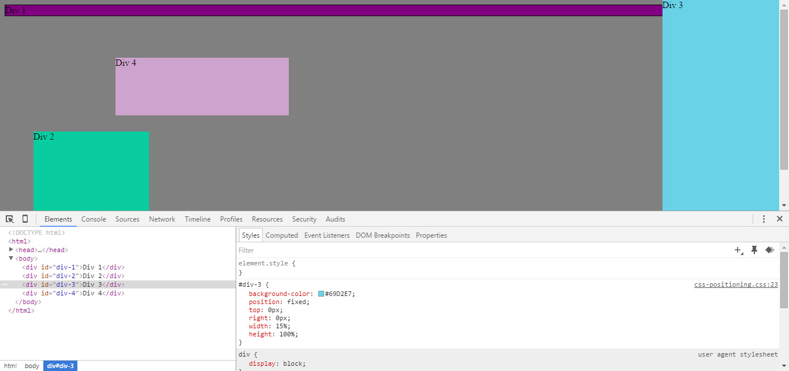
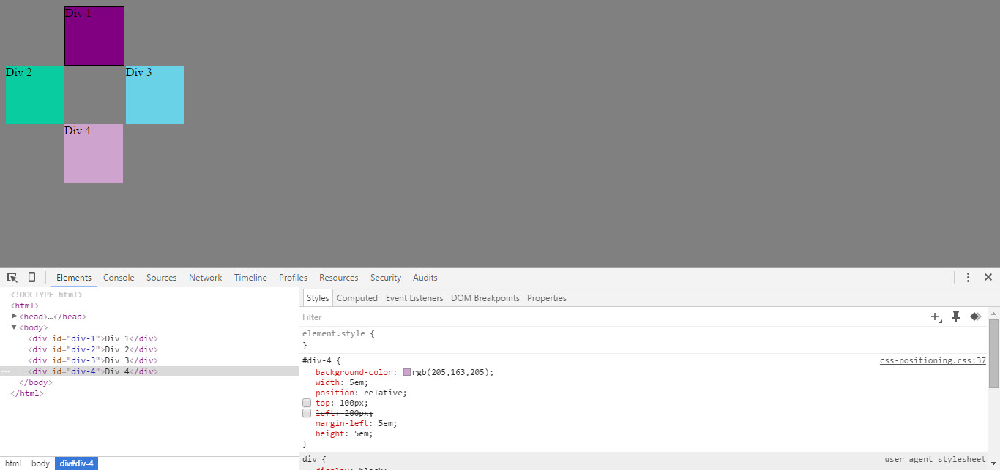

# Reflection 3.4 - Chrome DevTools

1. Display each of your screenshots for each exercise inline.

	## Exercise 1: Change the Colors
	
	 
	 
	## Exercise 2: Column
	
	 
	 
	## Exercise 3: Row
	
	 
	 
	## Exercise 4: Make Equidistant
	
	 
	 
	## Exercise 5: Squares
	
	 
	 
	## Exercise 6: Footer
	
	 
	 
	## Exercise 7: Header
	
	 
	 
	## Exercise 8: Sidebar
	
	 
	 
	## Exercise 9: Get Creative
	
	 
	 

2. Answer the following questions:

	1. **How can you use Chrome's DevTools inspector to help you format or position elements?**

		You can edit and try things out on the fly very quickly and easily, before you change the actual source file.

	2. **How can you resize elements on the DOM using CSS?**

		In Chrome, open the Inspector (for example by right-clicking on the element you want to resize), which displays the DOM.  Add/change the width and height (or any other size/positioning) attributes for the element

	3. **What are the differences between absolute, fixed, static, and relative positioning? Which did you find easiest to use? Which was most difficult?**

		* **static**: the default.  static doesn't place the element in any particular spot, and pays no attention to any top, right, bottom, or left attribute you've set.  static simply places the element where it would normally go in the normal flow of the page.

		* **relative**: places the element at a spot relative to its normal position.  The top, right, bottom, left attributes are used to determined where, relative to its normal position, the element should go.  For example, if the element would normally be in the upper lefthand corner, then if you set position:relative and top:10px right 20px then the element will be placed 10px down and 20px to the right of where it would normally go.

		* **absolute**: places the element relative to its closest ancestor that is positioned.  If there is no ancestor that is positioned, then the element is placed relative to the document, meaning it will move up and down, and potentially out of view, when scrolling.  The top, right, bottom, left attributes are used to position it relative to the ancestor/document.

		* **fixed**: fixes the element in one spot in relation to the viewport.  This means that as any scrolling occurs, the element will appear to not move; it will always stay in the same place in the viewport.  The top, right, bottom, left attributes are used to place the element relative to the viewport.

		I founc them all easy to use, but some made more problems than others.  Absolute usually creates problems because it blocks any normal flow from happening amongst it and all the other elements.  Fixed is super easy-to-use: presumably you choose fixed because you want the element to stay put and flow over / block other elements as they scroll by.

	4. **What are the differences between margin, border, and padding?**

		Pading, border, and margin are non-overlapping box-shaped elements that surround the content of an element.

		* **Padding** clears an area directly around the content.  It is always transparent.

		* **Border** is outside the padding and inside the margin.  The border can be made visible and given different colors, styles, thicknesses, etc.

		* **Margin** clears an area on the very outside of the element, to separate it from the (margins of) neighboring elements.  It is always transparent.

	5. **What was your impression of this challenge overall? (love, hate, and why?)**

		I found this challenge to be very difficult because I feel like I'm in only the beginning stages of getting a feel for how 'display', 'position', top, right, bottom, left, and the padding and margin attributes all play together.  I need a lot more practice and exercises before I'll feel some semblance of confidence with CSS positioning.