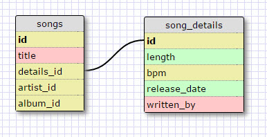
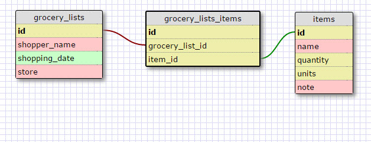

## Challenge 8.5 - More Schemas

### Release 2 - Create a One-to-one Schema

This is a one-to-one relationship because each song has only one set of song details, and each set of song details belong to only one song.  The reason that you might not want to keep them both together in one table is because you may want fast access to a small number of oft-desired song attributes.  If you were constantly accessing a huge table that included potentially dozens of attributes for each song, it would slow down the performance.  By splitting you can quickly access the info needed 90% of the time, and only have to access the huge slower song_details table 10% of the time.

### Release 4 - Many-to-Many Relationships

### Release 6 - Reflect

1. What is a one-to-one database?

	Where there are two tables, and a row in one table is only ever connected to exactly one row of the other table.  For example, a country only ever has one capital, or a car only ever has one steering wheel.  

2. When would you use a one-to-one database? (Think generally, not in terms of the example you created).

	Often, a one-to-one relationship is used for greater performance or ease of access.  For example, a capital city may have many attributes to keep track of, but if you're accessing and manipulating countries you don't want to have to drag along all those capital city attributes with every database operation.

3. What is a many-to-many database?

	A many-to-many database has two tables where the entities in one may be related to more than one in the other table, and vice-versa.  For example, Volleyball Tournaments and Volleyball Teams.  Every Volleyball Tournament involves several teams, and every Volleyball Team goes to several tournaments.

4. When would you use a many-to-many database? (Think generally, not in terms of the example you created).

	You would use a many-to-many database when your entities have multiple connections to each other, in both directions.

5. What is confusing about database schemas? What makes sense?

	I've got a background in databases and I love organization and organization schemes, so it all makes sense to me :-)
